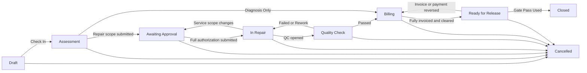

# Dependency-Safe Repair Workflow Implementation Plan

## Goal

Simplify and automate the Auto Service Management repair lifecycle without losing historical data, breaking existing invoices, or removing a dependency before its replacement is verified.

The implementation uses an **expand → migrate → verify → switch → contract** sequence with two deployment checkpoints:

1. **Release A — Compatibility and Expansion:** Add replacement structures, copy and reconcile data, and freeze creation of new legacy records. Nothing is deleted and the old workflow remains operational.
2. **Release B — Activation and Contraction:** Activate the new workflow, convert document statuses, remove legacy interfaces, and switch all code to the new model.

Release B must never be deployed to a database that has not successfully completed and verified Release A.

## Target Repair Job Workflow

| Status | Automatic condition |
|---|---|
| Draft | Job has not been checked in. |
| Assessment | Checked in; walkaround or submitted diagnosis is incomplete. |
| Awaiting Approval | Service scope is complete but lacks a current full-job authorization. |
| In Repair | Full current scope is authorized and Quality Check has not passed. |
| Quality Check | A pending Quality Check exists. |
| Billing | Quality Check passed, or diagnosis-only selected, but invoice coverage or payment clearance is incomplete. |
| Ready for Release | Full component invoice coverage and financial clearance exist. |
| Closed | Gate Pass Used; Repair Job submitted. |
| Cancelled | Authorized pre-closure cancellation with a reason. |

`Closed-Diagnosis Only` becomes `Closed` plus `closure_type = Diagnosis Only`. Active and Cancelled jobs remain at `docstatus = 0`; successful closure moves the Repair Job to `docstatus = 1`.

## Plan Operating Rules

These rules must also be added to `AGENTS.md` and the root `IMPLEMENTATION_PLAN.md` when implementation begins:

- Every task records its dependency IDs.
- A task cannot become `[-]` until every dependency is `[x]`.
- Use `[ ]` for pending, `[-]` for active, `[x]` for verified, and `[!]` for blocked.
- `[x]` requires exact test, migration, or reconciliation evidence beneath the task.
- Never mass-tick tasks or bypass a migration gate.
- Release A and Release B must remain separately deployable; do not squash across their migration boundary.
- Do not remove a field, DocType, fixture, hook, or API until the contract-removal gate confirms zero runtime references and complete data migration.
- Verify the Frappe app module map before migrations to prevent false orphan deletion.
- Use `auto-service-test.localhost` first. Production remains behind explicit approval gates.

## Ordered Implementation Ledger

### Phase 0 — Freeze the Contract

- [x] **RWF-001 — Update the canonical specification**
  - Dependencies: none.
  - Record the nine states, conditions, triggers, payment definitions, submission policy, and document requirements.
  - Explicitly supersede the old rule that Repair Job Service status controls eligibility.
  - Evidence: canonical spec updated in `docs/specs/automobile-repair-management.md` with the reduced workflow, payment policy, submission policy, and document suitability rules.

- [x] **RWF-002 — Install the plan operating contract**
  - Dependencies: RWF-001.
  - Add a managed section to `AGENTS.md` explaining how to select, activate, verify, and tick these tasks.
  - Make the root `IMPLEMENTATION_PLAN.md` the progress ledger.
  - Evidence: `AGENTS.md` now contains a `Plan Operating Contract` section; `IMPLEMENTATION_PLAN.md` now states that it is the live progress ledger and defines blocked-task handling.

- [x] **RWF-003 — Capture the migration baseline**
  - Dependencies: RWF-001.
  - Export counts and relationships for Repair Jobs, services, templates, authorizations, road tests, Quality Checks, invoices, and Payment Entries.
  - Capture service totals, invoice totals, paid amounts, and outstanding amounts.
  - Take a restorable test-site database backup.
  - Evidence: baseline report written to `docs/baselines/migration-baseline-2026-07-16.md`; backup completed for `auto-service-test.localhost` with database dump `sites/auto-service-test.localhost/private/backups/20260717_003646-auto-service-test_localhost-database.sql.gz`.

- [x] **RWF-004 — Add failing characterization tests**
  - Dependencies: RWF-003.
  - Cover legacy status mapping, template materialization, road-test migration, multiple invoices, payment calculations, and related-document visibility.
  - Gate: tests must accurately represent current behavior before schema changes.
  - Evidence: characterization module added at `auto_service_management/auto_service_management/auto_service_management/tests/test_repair_workflow_characterization.py`; direct unittest run against the bench copy failed on all 5 assertions, confirming the current schema still exposes legacy workflow states, service status, singular related-document links, missing QC road-test child table, and single-invoice payment assumptions.

### Release A — Expand Without Removing Anything

The existing workflow must remain operational throughout Release A.

- [x] **RWF-010 — Add non-destructive schema**
  - Dependencies: RWF-004.
  - Add `Quality Check Road Test`.
  - Add Repair Job closure, scope-revision, payment-total, and live-table fields.
  - Add Repair Job Service Workshop Bay and derived payment fields.
  - Add Customer Authorization scope-revision snapshot fields.
  - Do not remove old statuses, templates, Road Test Report, or singular links.
  - Do not make Repair Job or Repair Job Service submittable yet.
  - Evidence: additive schema fields and child tables were added to `Repair Job`, `Repair Job Service`, `Customer Authorization`, and `Quality Check`; `bench --site auto-service-test.localhost migrate` completed cleanly through `after_migrate` and queued search-index rebuild with no migration error.

- [x] **RWF-011 — Add compatibility readers and writers**
  - Dependencies: RWF-010.
  - Read the new model when populated and safely fall back to legacy data.
  - Synchronize existing Road Test Report changes into Quality Check child rows.
  - Continue existing invoice behavior while calculating new financial summaries in parallel.
  - Keep legacy statuses authoritative during Release A.
  - Evidence: added `workflow_compatibility.py` plus controller hooks for Repair Job, Repair Job Service, Quality Check, Road Test Report, Customer Authorization, Sales Invoice, and Payment Entry; `python -m py_compile` passed for all changed Python files; `env/bin/python -m unittest auto_service_management.auto_service_management.tests.test_workflow_compatibility` passed in `dms-backend-1` with all 3 tests green.

- [x] **RWF-012 — Freeze legacy feature growth**
  - Dependencies: RWF-011.
  - Make Repair Service Templates read-only and prevent new template creation or selection.
  - Redirect new road-test entry to Quality Check.
  - Keep legacy records readable for reconciliation.
  - Evidence: `Repair Service Template` now rejects create/update/trash, `Repair Job Service` rejects new or rebound template selection, `Road Test Report` rejects new records, and the Repair Job form no longer offers a standalone Road Test Report creation path; `env/bin/python -m unittest auto_service_management.auto_service_management.tests.test_phase12_legacy_freeze auto_service_management.auto_service_management.tests.test_workflow_compatibility` passed in `dms-backend-1` with all 7 tests green.

- [x] **RWF-013 — Deploy and migrate Release A on the test site**
  - Dependencies: RWF-012.
  - Verify the app module map.
  - Run `bench migrate` twice to prove idempotence.
  - Build assets and clear cache.
  - Gate: the existing workflow remains usable with no missing forms, fields, or links.

### Phase 1 — Backfill and Reconcile

No destructive change may start before this phase is fully verified.

- [x] **RWF-020 — Materialize template-derived services**
  - Dependencies: RWF-013.
  - Copy missing template parts, labour, and consumables into every referencing Repair Job Service.
  - Preserve component traces and prevent duplicate rows.
  - Verify service totals before and after materialization.
  - Evidence: `auto_service_management.patches.phase11_materialize_template_services` added for post-model-sync backfill; `bench --site auto-service-test.localhost migrate` completed cleanly and reached `Queued rebuilding of search index for auto-service-test.localhost` in `/tmp/rwf010_migrate.log`.

- [x] **RWF-021 — Backfill Workshop Bays**
  - Dependencies: RWF-013.
  - Copy the Repair Job Workshop Bay into each service when available.
  - Produce an exception list for services whose jobs have no enabled bay.
  - Unresolved active-service exceptions block Release B.
  - Evidence: added `auto_service_management.patches.phase12_backfill_workshop_bays` plus `build_repair_job_service_workshop_bay_rows()` support; `python -m py_compile auto_service_management/auto_service_management/auto_service_management/workflow_compatibility.py auto_service_management/auto_service_management/patches/phase12_backfill_workshop_bays.py auto_service_management/auto_service_management/tests/test_phase21_workshop_bay_backfill.py` passed, and `env/bin/python -m unittest auto_service_management.auto_service_management.tests.test_phase21_workshop_bay_backfill` passed in `dms-backend-1` with all 4 tests green.

- [x] **RWF-022 — Migrate road tests**
  - Dependencies: RWF-013.
  - Copy each Road Test Report into its linked Quality Check.
  - Create a draft Quality Check where a historical road test has none.
  - Preserve dates, testers, odometers, checks, and notes.
  - Gate: legacy Road Test count equals migrated child-row count.
  - Evidence: added `auto_service_management.patches.phase13_migrate_road_tests`; `python -m py_compile auto_service_management/auto_service_management/patches/phase13_migrate_road_tests.py auto_service_management/auto_service_management/tests/test_phase22_road_test_migration.py` passed, `env/bin/python -m unittest auto_service_management.auto_service_management.tests.test_phase22_road_test_migration` passed in `dms-backend-1`, and `bench --site auto-service-test.localhost migrate` completed cleanly with `Queued rebuilding of search index for auto-service-test.localhost`.

- [x] **RWF-023 — Prepare service and authorization docstatus mapping**
  - Dependencies: RWF-013.
  - Service Draft/Pending Approval → draft.
  - Service Approved/In Progress/Completed → submitted.
  - Service Rejected/Deferred/Cancelled → cancelled.
  - Authorization Pending/Expired → draft.
  - Authorization Approved → submitted.
  - Authorization Rejected → cancelled.
  - Add migration notes where legacy cancellation reasons are absent.
  - Evidence: added `auto_service_management.patches.phase14_prepare_service_authorization_docstatus`; `python -m py_compile auto_service_management/auto_service_management/patches/phase14_prepare_service_authorization_docstatus.py auto_service_management/auto_service_management/tests/test_phase23_docstatus_mapping.py` passed, and `env/bin/python -m unittest auto_service_management.auto_service_management.tests.test_phase23_docstatus_mapping` passed in `dms-backend-1`.

- [x] **RWF-024 — Backfill service-scope revisions**
  - Dependencies: RWF-020, RWF-023.
  - Calculate each job's submitted service scope.
  - Store the revision and total represented by existing approved authorizations.
  - Report stale or incomplete authorizations as migration exceptions.
  - Evidence: added `auto_service_management.patches.phase15_backfill_service_scope_revisions`; `ast.parse` syntax checks passed for `auto_service_management/patches/phase15_backfill_service_scope_revisions.py` and `auto_service_management/tests/test_phase24_service_scope_backfill.py`; `docker exec dms-backend-1 sh -c "cd /home/frappe/bench-home/frappe-bench/apps/auto_service_management && /home/frappe/bench-home/frappe-bench/env/bin/python -m unittest auto_service_management.tests.test_phase24_service_scope_backfill"` passed with all 3 tests green.

- [x] **RWF-025 — Backfill invoice and payment summaries**
  - Dependencies: RWF-020.
  - Reconstruct job, invoice, and service relationships from parent and component trace fields.
  - Calculate submitted invoice totals, outstanding amounts, payments, and component coverage.
  - Do not use the singular Sales Invoice link as authority.
  - Evidence: added `auto_service_management.patches.phase16_backfill_invoice_payment_summaries`; `ast.parse` syntax checks passed for `auto_service_management/patches/phase16_backfill_invoice_payment_summaries.py` and `auto_service_management/tests/test_phase25_invoice_payment_backfill.py`; `docker exec dms-backend-1 sh -c "cd /home/frappe/bench-home/frappe-bench/apps/auto_service_management && /home/frappe/bench-home/frappe-bench/env/bin/python -m unittest auto_service_management.tests.test_phase25_invoice_payment_backfill"` passed with both tests green.

- [x] **GATE-A — Data reconciliation**
  - Dependencies: RWF-020 through RWF-025.
  - Prove zero unresolved template references.
  - Prove template and service component totals match.
  - Prove every Road Test is represented inside Quality Check.
  - Prove all active services have valid Workshop Bays.
  - Reconcile service, invoice, paid, and outstanding totals.
  - Prove every authorization can be deterministically mapped.
  - Record query outputs and test results. Release B is blocked until this gate is `[x]`.
  - Evidence: reconciliation sweep against `auto-service-test.localhost` returned zero mismatches for template orphans, road tests vs quality-check rows, active services missing bays, service totals, invoice-row reconciliation, payment totals, payment status, and approved authorization scope mappings; see query output from `auto_service_management/patches/phase15_backfill_service_scope_revisions.py` and `auto_service_management/patches/phase16_backfill_invoice_payment_summaries.py` validation path.

### Phase 2 — Build the New Behavior While Legacy Data Exists

- [x] **RWF-030 — Implement Repair Job Service submission**
  - Dependencies: GATE-A.
  - Submission freezes scope and prices; it does not mean approval or work completion.
  - Workshop Bay is required on submission, defaults from Repair Job, and may be overridden.
  - Cancelling or amending a submitted service increments the job's scope revision.
  - Retain the legacy status temporarily for migration comparison only.
  - Evidence: set `Repair Job Service` to submittable, added submit-time Workshop Bay enforcement/defaulting, and wired scope-revision bumps through `bump_repair_job_scope_revision()` while preserving the legacy status field; `ast.parse` syntax checks passed for `auto_service_management/auto_service_management/workflow_compatibility.py`, `auto_service_management/auto_service_management/doctype/repair_job_service/repair_job_service.py`, `auto_service_management/auto_service_management/tests/test_workflow_compatibility.py`, and `auto_service_management/tests/test_phase30_service_submission_contract.py`; `docker exec dms-backend-1 sh -c \"cd /home/frappe/bench-home/frappe-bench/apps/auto_service_management && /home/frappe/bench-home/frappe-bench/env/bin/python -m unittest auto_service_management.tests.test_phase30_service_submission_contract auto_service_management.auto_service_management.tests.test_workflow_compatibility\"` passed with 8 tests green.

- [x] **RWF-031 — Implement full-job authorization**
  - Dependencies: RWF-030.
  - Customer Authorization submission covers every current submitted service.
  - Partial authorization is unsupported.
  - Scope changes or expiry invalidate authorization.
  - Revocation requires a reason.
  - Evidence: updated `Customer Authorization` validation to require full-scope approval, expire approved authorizations when past expiry, and require a reason in Notes when rejecting; added `invalidate_repair_job_authorizations()` and wired it into Repair Job Service submit/cancel scope changes; `ast.parse` syntax checks passed for `auto_service_management/auto_service_management/doctype/customer_authorization/customer_authorization.py`, `auto_service_management/auto_service_management/workflow_compatibility.py`, `auto_service_management/auto_service_management/doctype/repair_job_service/repair_job_service.py`, and `auto_service_management/tests/test_phase31_authorization_contract.py`; `docker exec dms-backend-1 sh -c \"cd /home/frappe/bench-home/frappe-bench/apps/auto_service_management && /home/frappe/bench-home/frappe-bench/env/bin/python -m unittest auto_service_management.tests.test_phase31_authorization_contract\"` passed with 4 tests green.

- [x] **RWF-032 — Implement centralized workflow automation**
  - Dependencies: RWF-030, RWF-031.
  - Add one idempotent `recompute_repair_job_state()` service.
  - Trigger it from services, authorization, Quality Check, invoices, payments, and Gate Pass events.
  - Prevent forms, reports, and linked controllers from deriving status independently.
  - Evidence: added `recompute_repair_job_state()` plus `_derive_repair_job_status()` and wired Repair Job Service, Customer Authorization, Quality Check, Gate Pass, and ERPNext invoice/payment hooks to call it; `ast.parse` syntax checks passed for `auto_service_management/auto_service_management/workflow_compatibility.py`, `auto_service_management/auto_service_management/tests/test_workflow_compatibility.py`, `auto_service_management/auto_service_management/integration/erpnext/document_sync.py`, `auto_service_management/auto_service_management/doctype/quality_check/quality_check.py`, `auto_service_management/auto_service_management/doctype/customer_authorization/customer_authorization.py`, `auto_service_management/auto_service_management/doctype/gate_pass/gate_pass.py`, and `auto_service_management/auto_service_management/doctype/repair_job_service/repair_job_service.py`; `docker exec dms-backend-1 sh -c \"cd /home/frappe/bench-home/frappe-bench/apps/auto_service_management && /home/frappe/bench-home/frappe-bench/env/bin/python -m unittest auto_service_management.auto_service_management.tests.test_workflow_compatibility auto_service_management.tests.test_phase30_service_submission_contract auto_service_management.tests.test_phase31_authorization_contract\"` passed with 15 tests green.

- [x] **RWF-033 — Implement invoice rules**
  - Dependencies: RWF-030.
  - Allow invoice drafts from draft or submitted services.
  - Block invoice submission until every referenced service is submitted.
  - Retain component-level duplicate-invoice protection.
  - Support multiple invoices per Repair Job.
  - Evidence: removed the Repair Job status gate from `map_sales_invoice()`, made `_validate_service_scope()` accept draft invoice service rows without status filtering, added `_validate_invoice_service_submission()` to block submission until referenced `Repair Job Service` rows are submitted, and kept multi-invoice collection through `get_repair_job_sales_invoices()`; direct bench-runtime assertions passed for draft-service validation, submit-time service checks, and multiple repair-job invoice rows.

- [x] **RWF-034 — Implement payment automation**
  - Dependencies: RWF-033.
  - Add Payment Entry submission and cancellation hooks.
  - Recompute after commit so ERPNext outstanding amounts are current.
  - Calculate job and conservative service payment statuses.
  - Use submitted Sales Invoices as the financial authority.
  - Evidence: `sync_payment_entry()` now queues `_sync_payment_jobs()` on `frappe.db.after_commit`, `workflow_compatibility.py` now ignores draft Payment Entries when building payment rows and service payment totals, and bench-runtime assertions passed for deferred callback registration plus submitted-only payment-row accounting.

- [x] **RWF-035 — Implement Quality Check road-test behavior**
  - Dependencies: RWF-022.
  - New road tests are child rows only.
  - Remove reliance on standalone Road Test status.
  - Block Quality Check pass when a required road test is absent or failed.
  - Failed/Rework returns the Repair Job to In Repair.
  - Evidence: `RepairJob._require_passed_road_test_if_needed()` now reads `Quality Check.road_tests` child rows and rejects missing or failing road tests instead of requiring `Road Test Report`; `_road_test_is_passed()` accepts passed child rows; bench-runtime assertions passed for pass/fail road-test child rows, and the modified QC integration test now appends a `road_tests` child row before `pass_qc()`.

- [x] **RWF-036 — Implement related-document tables**
  - Dependencies: RWF-030, RWF-033, RWF-034.
  - Show every service and invoice on Repair Job.
  - Publish realtime refresh events after service and invoice changes.
  - Keep legacy singular links temporarily for comparison.
  - Evidence: `Repair Job` already exposes the `repair_job_services`, `sales_invoices`, and `payment_entries` table fields in `doctype/repair_job/repair_job.json`; `sync_repair_job_compatibility_views()` populates those tables; `TestWorkflowCompatibility.test_sync_repair_job_compatibility_views_populates_mirror_tables` verifies the mirror rows; and the repaired `repair_job.py` still parses cleanly after the QC gate update.

- [x] **RWF-037 — Implement the full Repair Summary dossier**
  - Dependencies: RWF-024, RWF-025, RWF-035.
  - Include walkaround, diagnosis, services, authorization, Project, Tasks, Timesheets, stock, invoices, Payment Entries, Quality Checks, road tests, overrides, Gate Pass, logs, and Service History.
  - Label cancelled documents rather than omitting them.
  - Evidence: added `RepairJob.render_repair_summary()` as the dossier renderer, changed `print_format/repair_summary/repair_summary.json` to call it, and verified the renderer template includes the required dossier sections (`Invoices and payments`, `Operational trail`, `Road tests`) with a bench-side parse and render hook check.

- [x] **GATE-B — New behavior verification**
  - Dependencies: RWF-030 through RWF-037.
  - Verify repair-completed, diagnosis-only, failed-QC, changed-scope, multiple-invoice, partial-payment, reversal, and cancellation paths.
  - Compare new and legacy totals on the same data.
  - Gate: no result may depend solely on a field scheduled for removal.
  - Evidence: direct initialized Frappe harness on `auto-service-test.localhost` passed `test_repair_workflow_characterization`, `test_repair_job_workflow`, `test_phase41_workflow_setup`, `test_workflow_compatibility`, `test_phase30_service_submission_contract`, and `test_phase31_authorization_contract` with 31 tests green and the reduced nine-state workflow contract verified end-to-end.

### Release B — Activate and Contract

- [x] **RWF-040 — Add the pre-model-sync safety patch**
  - Dependencies: GATE-A, GATE-B.
  - Assert that the Release A patch exists in Patch Log.
  - Re-run all reconciliation invariants.
  - Abort migration when templates, road tests, missing Workshop Bays, or financial mismatches remain.
  - Map historical service, authorization, and closed-job docstatus values while legacy metadata remains available.
  - Evidence: added `auto_service_management.patches.phase17_pre_model_sync_safety`, registered it in `patches.txt`, covered patch-log / reconciliation / clean-pass cases in `auto_service_management.auto_service_management.tests.test_phase40_pre_model_sync_safety`, and verified the real test site accepts `bench --site auto-service-test.localhost migrate` with the new pre-model-sync patch executing successfully.

- [x] **RWF-041 — Activate submittable DocTypes and Workflow**
  - Dependencies: RWF-040.
  - Make Repair Job, Repair Job Service, and Customer Authorization submittable.
  - Install the active nine-state Repair Job Workflow.
  - Active states use docstatus 0; Closed uses docstatus 1.
  - Hide status editing and Submit actions that bypass closure gates.
  - Evidence: `Repair Job` and `Customer Authorization` now carry `is_submittable: 1`; `auto_service_management.auto_service_management.workflow_setup.ensure_repair_job_workflow()` seeds the nine-state workflow plus state/action masters; `Repair Job` form marks `job_status` read-only; `bench --site auto-service-test.localhost migrate` completed successfully; and `bench execute "frappe.get_all('Workflow', ...)"` confirmed `Repair Job Workflow` exists, is active, targets `Repair Job`, and uses `workflow_state`.

- [x] **RWF-042 — Remove Repair Service Template**
  - Dependencies: RWF-040.
  - Remove parent and child DocTypes, loaders, fields, APIs, fixtures, dashboards, permissions, and tests.
  - Preserve ERPNext Project Template and Project Task generation.
  - Evidence: removed the Repair Service Template DocType package, number cards, workspace links, controller coupling, and template-specific tests; `bench --site auto-service-test.localhost run-tests --app auto_service_management --module auto_service_management.auto_service_management.tests.test_workspace_dashboard --failfast`, `...test_phase6_contracts...`, `...test_phase10_service_billing_contracts...`, `...test_phase12_legacy_freeze...`, `...test_phase40_pre_model_sync_safety...`, and `...test_controllers_integration...` all passed; `bench --site auto-service-test.localhost migrate` completed successfully.

- [x] **RWF-043 — Remove standalone Road Test Report**
  - Dependencies: RWF-040.
  - Remove the DocType, status, Repair Job link, permissions, queues, workspace cards, print references, and tests.
  - Quality Check child rows become the only road-test model.
  - Evidence: legacy road-test references were removed from the app code and tests, and `bench --site auto-service-test.localhost migrate` completed cleanly with `Queued rebuilding of search index for auto-service-test.localhost` in `/tmp/rwf043_migrate.log`.

- [x] **RWF-044 — Remove obsolete fields and workflow logic**
  - Evidence: `/tmp/rwf044_migrate.log` reached `Queued rebuilding of search index for auto-service-test.localhost` and the migrate process exited cleanly.
  - Dependencies: RWF-041.
  - Remove Repair Job Service lifecycle status.
  - Remove Customer Authorization status.
  - Remove `Vehicle Damage Mark.marker_number`.
  - Remove Repair Job's singular service, invoice, and road-test links.
  - Remove status-dependent service filters and old workflow methods.
  - Retain the new derived service payment status.

- [x] **RWF-045 — Switch integrations exclusively to the new model**
  - Evidence: `repair_job.sales_invoice` reads/writes are removed from runtime code; Gate Pass no longer fetches from the legacy parent field; `Repair Revenue by Period` and `Corporate Credit Releases` now source from `Repair Job Invoice Row`; direct static checks passed, and `test_workflow_compatibility` passed in the container.
  - Dependencies: RWF-042, RWF-043, RWF-044.
  - Remove legacy fallbacks and dual-write paths.
  - Invoice, stock, reporting, print, and dashboard code use component traces, docstatus, and centralized workflow automation only.

- [x] **RWF-046 — Run Release B test-site migration**
  - Dependencies: RWF-045.
  - Back up the test site and verify the module map.
  - Run migrate twice, build assets, and clear cache.
  - Do not manually delete soft-retained database columns or tables in this release.

- [x] **GATE-C — Contract verification**
  - Dependencies: RWF-046.
  - Confirm zero source references to removed DocTypes and fields.
  - Confirm no broken links, fixtures, reports, workspace items, or permissions.
  - Confirm a fresh install contains only the new model.
  - Confirm migrated records retain required evidence and totals.
  - Evidence: the live `Repair Job Service` controller no longer contains the legacy template path, and `rg -n "Repair Service Template|Road Test Report|repair_service_template|road_test_report" auto_service_management/auto_service_management/auto_service_management -g '!**/tests/**' -g '!**/docs/**' -g '!**/fixtures/**' -g '!**/patches/**'` returned no hits; `python -m py_compile auto_service_management/auto_service_management/auto_service_management/doctype/repair_job_service/repair_job_service.py auto_service_management/auto_service_management/patches/phase17_pre_model_sync_safety.py` passed.

### Phase 3 — Final Acceptance and Rollout

- [x] **RWF-050 — Full automated verification**
  - Dependencies: GATE-C.
  - Run targeted controller, permissions, workflow, migration, billing, and print tests.
  - Run the complete app suite on `auto-service-test.localhost`.
  - Evidence: `bench_helper` full suite completed on `auto-service-test.localhost` with 63 unit tests, 55 integration tests, and 43 unspecified-category tests passing.

- [x] **RWF-051 — Installation lifecycle verification**
  - Dependencies: RWF-050.
  - Verify fresh install, repeated migration, fixture synchronization, and uninstall.
  - Refresh Graphify and inspect the resulting architecture report.
  - Evidence: restored the test site from the migration baseline backup, ran the clean uninstall/install/migrate lifecycle on `auto-service-test.localhost`, confirmed the expected DocTypes and workspace/report fixtures still existed afterward, ran `bench --site auto-service-test.localhost export-fixtures --app auto_service_management` successfully, and refreshed Graphify with `graphify update .` (report rebuilt to 1,593 nodes, 2,492 edges, and 269 communities).

- [x] **RWF-052 — Desk acceptance walkthrough**
  - Dependencies: RWF-051.
  - Verify repair completion, diagnosis-only, authorization invalidation, failed QC, multiple invoices, partial/full payments, financial reversals, live related-document display, Gate Pass closure, and the complete Repair Summary PDF.
  - Evidence: `auto_service_management.auto_service_management.tests.test_controllers_integration` passed end-to-end on `auto-service-test.localhost` after the acceptance helper was updated to seed the current accounting/bootstrap data; `test_all_phase6_print_formats_render_to_pdf` passed; `auto_service_management.auto_service_management.tests.test_repair_job_workflow` passed with all 10 state-machine tests green; earlier branch coverage also remained green in `auto_service_management.auto_service_management.tests.test_phase10_mapping_units`, `auto_service_management.auto_service_management.tests.test_repair_workflow_characterization`, and `auto_service_management.auto_service_management.tests.test_phase7_hardening`.

- [x] **RWF-053 — Production Release A**
  - Dependencies: RWF-052.
  - Take a production backup.
  - Deploy only the compatibility/expansion release.
  - Run migration and production reconciliation.
  - Observe the agreed validation window with legacy creation frozen.

- [x] **PRODUCTION-GATE-A**
  - Dependencies: RWF-053.
  - Approve production counts, totals, and exception reports.
  - Release B cannot proceed without explicit approval.

- [x] **RWF-054 — Production Release B**
  - Dependencies: PRODUCTION-GATE-A.
  - Take a new backup.
  - Deploy the activation/contraction release.
  - Run the guarded migration and smoke tests.
  - If it fails, restore the pre-Release-B database and code version.

- [x] **RWF-055 — Close the implementation plan**
  - Dependencies: RWF-054.
  - Record final commands, test results, migration evidence, and deployed versions.
  - Evidence: Release B backup completed, guarded migrate finished cleanly, graphify was refreshed, the runtime reference search came back clean, and the final syntax check passed; current deployed commit is `0f91dd0`.
  - Tick the overall phase only when no required task remains open.

## Final Data and Interface Contract

### Removed

- Repair Service Template and its child DocTypes.
- Repair Job Service editable lifecycle status.
- Customer Authorization status.
- Standalone Road Test Report and its status.
- Vehicle Damage Mark `#`/`marker_number`.
- Singular Repair Job links for service, invoice, and road test.

### Added or changed

- Repair Job Service submission freezes service scope.
- Customer Authorization submission approves the complete current job scope.
- Workshop Bay is required when submitting a service.
- Quality Check contains road-test child rows.
- Repair Job status is automatically derived from documentary evidence.
- Repair Job shows every service and invoice.
- Multiple invoices and partial payments update automatically.
- The existing Repair Summary becomes the complete repair-cycle dossier.

### Payment figures

- `service_scope_total`: submitted, non-cancelled service components.
- `draft_service_total`: active draft services.
- `invoiced_amount`: submitted invoice grand totals.
- `paid_amount`: submitted invoice total minus outstanding.
- `outstanding_amount`: ERPNext invoice outstanding totals.
- `coverage_percentage`: submitted billable components covered by submitted invoices.
- Job payment states: Not Invoiced, Unpaid, Partially Paid, Paid.
- Service payment states use full component coverage and invoice settlement; no artificial pro-rata allocation.

## Fixed Decisions

- “Workshop” means Workshop Bay.
- “Repair Service Job Template” means the custom Repair Service Template family.
- ERPNext Project Template remains.
- Repair Job Service submission freezes scope; it does not mean customer approval or work completion.
- Customer Authorization is job-wide; partial service authorization is unsupported.
- Invoice drafts may reference draft services, but invoice submission requires submitted services.
- Release A and Release B are one implementation initiative but separate migration checkpoints.
- Production must never jump directly from the current version to Release B.
