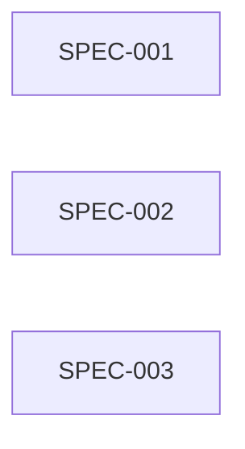

SPEC EXECUTION MAP STATUS: CURRENT
Spec Dependency Digest: sha256:077c442618f4fbf600e843a881c0b268f7d6965283af664542ddbcd194470b7d
Implementation Authorization: NOT_GRANTED
Review Mode: MULTI_AGENT

## 1. Execution Summary

Total Specs: 3
Execution Waves: 3
Maximum Safe Parallelism: 1
Critical Path: SPEC-001
Synchronization Waves: 1, 2
Fan-Out Points: -
Fan-In Points: -

All three slices declare no hard dependency. They are sequenced because each writes or reads the shared Repair Job intake/transition boundary; this preserves deterministic integration and prevents stale customer/contact/source state.

## 2. Spec Dependency Map

| Spec | Depends On | Unlocks | Parallelizable With | Must Not Run With | Reason |
| --- | --- | --- | --- | --- | --- |
| SPEC-001 | - | - | - | SPEC-002, SPEC-003 | Shares the Repair Job intake and transition boundary with SPEC-002 and SPEC-003. |
| SPEC-002 | - | - | - | SPEC-001, SPEC-003 | Shares the Repair Job intake and transition boundary with SPEC-001 and SPEC-003. |
| SPEC-003 | - | - | - | SPEC-001, SPEC-002 | Reads mutable Repair Job source state while the earlier slices write that boundary. |

## 3. Dependency Graph

## 4. Execution Waves

Wave 1: SPEC-001
Prerequisites 1: -
Exit Gate 1: IMPLEMENTED_AND_QA_PASS
Unlocks 1: SPEC-002

Wave 2: SPEC-002
Prerequisites 2: -
Exit Gate 2: IMPLEMENTED_AND_QA_PASS
Unlocks 2: SPEC-003

Wave 3: SPEC-003
Prerequisites 3: -
Exit Gate 3: IMPLEMENTED_AND_QA_PASS
Unlocks 3: -

## 5. Critical Path

Critical Path: SPEC-001
Critical Path Effort: 5

## 6. Parallel Execution Groups

Parallel Group 1: SPEC-001
Parallel Group 2: SPEC-002
Parallel Group 3: SPEC-003

## 7. Final Execution Order

START → [SPEC-001] → [SPEC-002] → [SPEC-003] → COMPLETE

## 8. Validation Evidence

Dependency Reviewer ID: 01a052d8-eb73-77f3-a259-916c94b025e7
Conflict Reviewer ID: 01a052e8-e95b-7e73-90e3-c84350e533d3
Tracer validator: PASS (3 specs, 18 product acceptance IDs).
Coherence review: PASS (SCR-20260830-001), accepted package, 0 open issues.
Implementation Authorization: NOT_GRANTED in this map; runtime authorization is supplied by the current user request.

<!-- SPEC_EXECUTION_MAP_MACHINE_V1
SPEC-001 | -
SPEC-002 | -
SPEC-003 | -
-->

<!-- SPEC_EXECUTION_PLAN_V1
{
  "schema_version": 1,
  "status": "CURRENT",
  "spec_dependency_digest": "sha256:077c442618f4fbf600e843a881c0b268f7d6965283af664542ddbcd194470b7d",
  "coherence_review_id": "SCR-20260830-001",
  "coherence_snapshot_digest": "sha256:009e43d4fb47d0d5c0316f4cbe1dfccf7f00803f51515eeb36a165fc82a68d11",
  "implementation_authorization": "NOT_GRANTED",
  "review_mode": "MULTI_AGENT",
  "reviewers": [
    {"role":"DEPENDENCY","reviewer_id":"01a052d8-eb73-77f3-a259-916c94b025e7","status":"PASS"},
    {"role":"CONFLICT","reviewer_id":"01a052e8-e95b-7e73-90e3-c84350e533d3","status":"PASS"}
  ],
  "specs": [
    {
      "id":"SPEC-001",
      "depends_on":[],
      "unlocks":[],
      "can_start_immediately":true,
      "wave":1,
      "parallelizable_with":[],
      "must_not_run_with":["SPEC-002","SPEC-003"],
      "resources":[
        {"name":"api:post-/repair-job-check-in","mode":"WRITE"},
        {"name":"db:customer-vehicle","mode":"WRITE"},
        {"name":"db:repair-job","mode":"WRITE"},
        {"name":"state:repair-job-check-in","mode":"WRITE"}
      ],
      "conflict_reason":"Shares the Repair Job intake and transition boundary with SPEC-002 and SPEC-003."
    },
    {
      "id":"SPEC-002",
      "depends_on":[],
      "unlocks":[],
      "can_start_immediately":true,
      "wave":2,
      "parallelizable_with":[],
      "must_not_run_with":["SPEC-001","SPEC-003"],
      "resources":[
        {"name":"api:post-/repair-job-check-in","mode":"WRITE"},
        {"name":"db:repair-job","mode":"WRITE"},
        {"name":"state:repair-job-check-in","mode":"WRITE"}
      ],
      "conflict_reason":"Shares the Repair Job intake and transition boundary with SPEC-001 and SPEC-003."
    },
    {
      "id":"SPEC-003",
      "depends_on":[],
      "unlocks":[],
      "can_start_immediately":true,
      "wave":3,
      "parallelizable_with":[],
      "must_not_run_with":["SPEC-001","SPEC-002"],
      "resources":[
        {"name":"api:post-/sales-order-get-items","mode":"WRITE"},
        {"name":"db:repair-job","mode":"READ"},
        {"name":"db:sales-order","mode":"WRITE"},
        {"name":"state:sales-order-item-retrieval","mode":"WRITE"}
      ],
      "conflict_reason":"Reads mutable Repair Job source state while the earlier slices write that boundary."
    }
  ],
  "waves":[
    {"wave":1,"specs":["SPEC-001"],"prerequisites":[],"exit_gate":"IMPLEMENTED_AND_QA_PASS","unlocks":["SPEC-002"]},
    {"wave":2,"specs":["SPEC-002"],"prerequisites":[],"exit_gate":"IMPLEMENTED_AND_QA_PASS","unlocks":["SPEC-003"]},
    {"wave":3,"specs":["SPEC-003"],"prerequisites":[],"exit_gate":"IMPLEMENTED_AND_QA_PASS","unlocks":[]}
  ],
  "fan_out_points":[],
  "fan_in_points":[],
  "critical_path":["SPEC-001"],
  "critical_path_effort":5,
  "maximum_safe_parallelism":1
}
-->
