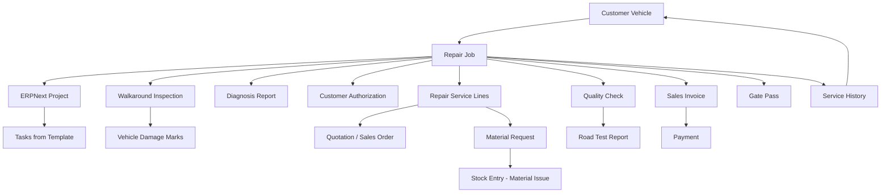

# Real-World Workflows — Auto Service Management

> How the system actually feels when real people use it, in the situations that actually happen.

---

## The Cast

| Role | Who they are | What they care about |
|------|-------------|---------------------|
| **Service Advisor** | The first face the customer sees. Sits at the front desk, types fast, knows every car by its sound. | Getting the car checked in fast, keeping the customer informed, not losing paperwork. |
| **Workshop Technician** | Hands-on. Gets assigned jobs, logs hours, knows when a bolt needs an extra quarter-turn. | Clear instructions, no paperwork for paperwork's sake, credit for hours worked. |
| **Parts Interpreter** | The person who knows which part fits which model year, who calls suppliers, who tracks inventory. | Accurate parts lists, knowing what's in stock, not ordering the wrong thing twice. |
| **Workshop Manager** | Oversees the floor. Signs off on quality, handles exceptions, keeps the queue moving. | Nothing leaves the shop that isn't right, and nothing sits around longer than it should. |
| **Cashier** | Handles the money. Creates invoices, processes payments, manages corporate credit accounts. | Correct totals, clean payment records, no surprise write-offs. |
| **Security Gate Officer** | Controls what leaves the premises. Checks gate passes, verifies identity, stamps the exit. | Every car leaving has a valid gate pass, paid for or approved. No exceptions. |

---

## The Status Flow

Every repair job moves through the same state machine. Here's the map:

```
Draft
  → Checked In
    → Walkaround Inspection
      → Diagnosis
        → Estimate Prepared
          → Waiting for Customer Approval
            → Approved
              → In Repair
                → Quality Check
                  → Ready for Invoice
                    → Invoiced
                      → Gate Pass Issued
                        → Closed
```

Two branch paths exist:

- **Diagnosis Only**: The customer just wants to know what's wrong. After diagnosis, the job goes straight to invoice and closes as "Closed — Diagnosis Only."
- **Partial Approval**: The customer approves some lines, rejects others. Only approved lines get repaired.

Cancellation is allowed from any non-terminal state.

---

## Use Case 1: The Normal Walk-In Repair

**The scene:** It's Monday morning. A regular customer, Patrick, drives in with his Toyota Hilux. The battery has been dying slowly, and he heard a weird scraping noise from the front brakes last week. He wants everything checked and fixed.

### What happens

**Service Advisor (Grace)** searches for the vehicle by registration number. The system finds the Hilux — it's been here twice before. Patrick's profile, service history, and vehicle details all come up.

Grace creates a new Repair Job. She enters the current odometer reading (87,432 km), the customer's complaint: *"Battery dies overnight, scraping noise from front brakes, general engine check."* She assigns the job to Workshop Bay 2 and promises delivery by Wednesday afternoon.

**System action:** A linked Project is created automatically. Tasks are generated from the Project Template — one for battery diagnostics, one for brake inspection, one for general engine check. Each task gets assigned to the mechanic.

**Workshop Technician (James)** takes over. He performs a walkaround inspection — walks around the Hilux with the tablet, marks two scratches on the rear bumper on the vehicle silhouette, notes the fuel level at 3/4, and records the odometer. The customer signs the walkaround form on screen.

James moves the job to Diagnosis. He discovers the battery is indeed dead (3 years old, past its life), the brake pads are worn to 2mm, and the engine check reveals a loose air filter housing. He creates a Diagnosis Report with findings and recommendations.

**Parts Interpreter (David)** is notified. He looks up the parts: one Toyota-compatible battery, front brake pads for Hilux 2019, and a new air filter. Two are in stock; the brake pads need ordering. He adds the parts to the service lines.

Grace prepares the estimate: battery replacement (parts + labour), brake pad replacement (parts + labour), air filter replacement (parts + labour). Total comes to UGX 890,000. She sends it to the customer.

Patrick approves everything. Grace marks the lines as Approved and moves the job to "In Repair."

James gets to work. He replaces the battery, swaps the brake pads, and fits the new air filter. He logs his time on each task — 1.5 hours for battery, 1 hour for brakes, 20 minutes for the air filter. Each hour is captured in a Timesheet linked to the Repair Job.

**Workshop Manager (Sam)** performs Quality Check. He verifies the battery holds charge, the brakes feel solid, and the engine runs clean. He marks QC as Passed. He decides a road test isn't needed for this type of job.

The job moves to Ready for Invoice. Grace creates the Sales Invoice. Patrick pays UGX 890,000 in cash at the counter. The invoice is submitted.

**Security Gate Officer (Musa)** issues a Gate Pass. He checks the invoice is paid, verifies Patrick's ID against the job record, and stamps the pass. Patrick drives away.

The system closes the job. Service History is created — a permanent snapshot of what was done, when, and for how much. The Hilux's odometer and last service date are updated in the Customer Vehicle record.

### Status journey

```
Draft → Checked In → Walkaround Inspection → Diagnosis → Estimate Prepared
→ Waiting for Customer Approval → Approved → In Repair → Quality Check
→ Ready for Invoice → Invoiced → Gate Pass Issued → Closed
```

### What the system enforces

- You cannot create a Repair Job without a Customer, Vehicle, odometer reading, and reason for visit.
- The Project is created exactly once, on check-in.
- In Repair requires an approved Customer Authorization.
- Gate Pass requires a submitted and paid invoice.
- Closing requires a used Gate Pass and creates Service History exactly once.
- Every status change is logged in Repair Job Log with timestamp, user, and old/new values.

---

## Use Case 2: First-Time Customer, New Vehicle

**The scene:** A woman walks in driving a Honda Fit she just bought from a friend. She has no account with the workshop, and neither does the car. She wants a full service before she trusts it on the highway.

### What happens

**Service Advisor (Grace)** searches by registration number — nothing comes up. The system says "No vehicle found."

Grace creates a new Customer record — name, phone, email. Then she creates a Customer Vehicle profile: registration number UAX 445B, Honda Fit 2017, VIN, engine number, white, petrol, automatic, odometer at 52,100 km.

**Important rule enforced by the system:** No Repair Job can exist without a Customer, a Vehicle, an odometer reading, and a reason for visit. Grace cannot skip any of these. The system won't let her create a "mystery paper" job.

Grace creates the Repair Job linked to the new customer and vehicle. She enters the complaint: *"Full service, check everything, want to know if anything needs attention."*

From here, the workflow follows the same path as Use Case 1 — walkaround, diagnosis, estimate, approval, repair, QC, invoice, gate pass, close.

### What's different

- The Customer and Vehicle are brand new — no prior service history exists.
- After closure, the Service History entry becomes the first record in this vehicle's service timeline.
- Future visits will show this car's complete history.

---

## Use Case 3: Diagnosis Only — "Just Tell Me What's Wrong"

**The scene:** Samuel brings in his Nissan X-Trail. The check engine light has been on for a week. He doesn't want to commit to repairs yet — he wants to know the damage first, literally.

### What happens

**Service Advisor (Grace)** checks in the vehicle. Walkaround inspection is performed. The job moves to Diagnosis.

**Workshop Technician (James)** diagnoses the issue: the oxygen sensor is faulty, and the catalytic converter is showing early signs of wear. He estimates UGX 1,200,000 for the full repair (sensor + converter + labour).

Grace prepares the estimate and explains the situation to Samuel. He goes pale. He says he needs to think about it — or maybe sell the car. He does not approve any service lines.

Grace moves the job to "Ready for Invoice" (diagnosis fee only). She invoices the diagnosis fee of UGX 150,000. Samuel pays at the counter.

The Gate Pass is issued. Samuel drives away with a diagnosis report and a heavy heart.

The system closes the job as **"Closed — Diagnosis Only."**

### Status journey

```
Draft → Checked In → Walkaround Inspection → Diagnosis → Ready for Invoice
→ Invoiced → Gate Pass Issued → Closed - Diagnosis Only
```

### What the system enforces

- No repair parts are consumed — no Material Requests, no Stock Entries.
- No Customer Authorization is required because no repair work was performed.
- The diagnosis-only path is a recognized terminal state. The job doesn't hang in limbo.
- Samuel's vehicle still has a complete record: what was found, what it would cost, and what he chose to do.

---

## Use Case 4: Partial Approval — "Fix This, Not That"

**The scene:** Robert brings his Mitsubishi Pajero for a brake noise. During diagnosis, the technician also discovers a leaking power steering hose and worn windshield wipers. Robert has a budget.

### What happens

The walkaround and diagnosis proceed normally. The diagnosis reveals three issues:

1. Brake pads worn (urgent) — UGX 350,000
2. Power steering hose leaking (recommended) — UGX 480,000
3. Wipers worn (minor) — UGX 45,000

Grace prepares the estimate and sends it to Robert. He says: *"Do the brakes. Skip the steering hose — I'll handle it next month. And throw in the wipers, they're cheap enough."*

Grace applies line-level decisions:

| Service Line | Customer Decision | Line Status |
|-------------|------------------|-------------|
| Brake pads (parts + labour) | Approved | Approved |
| Power steering hose (parts + labour) | Rejected | Rejected |
| Wipers (parts + labour) | Approved | Approved |

**System behavior:** Only the approved lines enter the repair queue. The rejected line stays on the record with its status — it's not deleted, it's not forgotten. When Robert comes back next month, the system already knows what he deferred.

The repair proceeds on approved lines only. QC covers only the brake and wiper work. The invoice includes only approved line items. The rejected steering hose amount never touches the invoice.

### What the system enforces

- Each Repair Service Line has its own status: Pending Approval → Approved/Rejected → Completed/Cancelled.
- Parts are requested and issued only for approved lines.
- The invoice total reflects only approved work.
- The rejected line remains visible in the job history — useful for the next visit.

---

## Use Case 5: The Corporate Fleet — Batch Service

**The scene:** A logistics company, QuickHaul Ltd., has 8 delivery vans that all need brake inspections and oil changes before the quarter-end audit. They want it done in one batch, not eight separate visits.

### What happens

**Workshop Manager (Sam)** creates a **Fleet Service Campaign** — "Q2 QuickHaul Brake & Oil Service." He links it to the corporate customer, sets the start and end dates, and adds a description.

Each van gets its own Repair Job — because every vehicle is different, needs its own inspection, and might reveal different issues. The campaign groups them but never merges them.

| Van | Registration | Repair Job | Status |
|-----|-------------|-----------|--------|
| Van 1 | UAH 101A | RJ-2026-00100 | In Repair |
| Van 2 | UAH 102B | RJ-2026-00101 | Quality Check |
| Van 3 | UAH 103C | RJ-2026-00102 | Approved |
| ... | ... | ... | ... |

The system rejects any attempt to add a van from a different customer to the same campaign. It also rejects duplicate Repair Jobs for the same vehicle in the same campaign.

**Parts Interpreter (David)** sees the aggregated parts needs across all 8 vans. He can batch-order brake pads and oil filters, then distribute them to individual jobs.

The **Daily Workshop Load** report shows how many vans are in each stage. The **Technician Productivity** report shows who's handling which vehicles. The campaign gives management a bird's-eye view without losing the per-vehicle detail.

### What the system enforces

- Fleet Service Campaign groups independent Repair Jobs — never merges them.
- Each job maintains its own customer, vehicle, authorization, and invoice.
- Duplicate or cross-customer vehicles are rejected at the campaign level.

---

## Use Case 6: The Surprise Upsell — Walkaround Finds More

**The scene:** Grace checks in a Subaru Outback for an oil change. During the walkaround, James notices the front tyres are dangerously worn and there's oil leaking from the valve cover gasket. The customer only came for oil.

### What happens

The walkaround inspection captures the tyre wear and oil leak as damage marks on the vehicle silhouette. The customer sees the photos on screen and agrees: *"Yeah, I've been meaning to sort those tyres."*

James performs diagnosis. He documents three items:

1. Oil change (original request) — UGX 120,000
2. Front tyres (discovered during walkaround) — UGX 600,000
3. Valve cover gasket (discovered during walkaround) — UGX 180,000

The estimate goes to the customer. He approves the oil change and tyres but wants to think about the gasket. Grace marks the gasket line as Rejected.

The system proceeds with oil change and tyres only. The gasket stays on record. When the customer returns in two weeks, the system already knows about the deferred repair.

---

## Use Case 7: Corporate Credit Release

**The scene:** QuickHaul Ltd. has a corporate account with 30-day payment terms. One of their vans needs an urgent brake repair. The invoice is UGX 450,000. QuickHaul's fleet manager says they'll pay at end of month.

### What happens

Grace creates the invoice and submits it. At the gate, the Security Gate Officer tries to issue a Gate Pass — but the invoice is unpaid. Normally, the car doesn't leave.

However, QuickHaul has:

- A submitted Sales Invoice (not draft)
- An explicit **"Allow Credit Release"** flag set on their Customer record
- Payment terms configured (30 days)
- Available credit within their limit

The system allows the credit release. The Gate Pass is issued. The van leaves.

**System safeguards:**

- If the credit limit is breached, the release is blocked. No gate pass. No exceptions without a Workshop Manager override.
- If payment terms are not configured, credit release is blocked.
- If the invoice is still in draft, credit release is blocked — period.
- Every credit release is logged. The **Corporate Credit Releases** report shows who approved what, when, and for how much.

---

## Use Case 8: The Quality Reject — Rework Required

**The scene:** James finishes replacing the clutch on a Toyota Corolla. He marks the job as complete and ready for QC. Sam, the Workshop Manager, performs the quality check — and the clutch pedal feels wrong. It's not engaging properly.

### What happens

Sam marks QC as **Failed** with notes: *"Clutch engagement point too high. Pressure plate may not be seated correctly. Rework required."*

The job goes back to **In Repair** status. James re-seats the pressure plate, adjusts the hydraulic line, and tests again. He marks the task as reworked.

Sam performs QC again. This time it passes. The job proceeds to Ready for Invoice.

### Status journey

```
... → In Repair → Quality Check (Failed) → In Repair → Quality Check (Passed) → Ready for Invoice
```

### What the system enforces

- QC can send the job back to In Repair — it's a valid transition.
- Every QC attempt is logged in Repair Job Log with the result and notes.
- The job cannot skip QC to reach Ready for Invoice.

---

## Use Case 9: The Diagnostic Dilemma — Road Test Required

**The scene:** A BMW 5 Series comes in with intermittent transmission slipping. The technician diagnoses it as a mechatronic unit issue. After the repair, the Workshop Manager decides a road test is mandatory before clearing QC.

### What happens

QC is marked as **Passed but Road Test Required**. The Road Test Report is created with:

- Route: Workshop → Jinja Highway → Return (15 km loop)
- Odometer start: 142,300 km → end: 142,315 km
- Braking: Normal
- Steering: Normal
- Transmission: Smooth, no slipping observed
- Warning lights: None
- Overall: Pass

The road test result feeds back into the QC. With both QC and road test passed, the job moves to Ready for Invoice.

### What the system enforces

- Road Test is conditional — not every job requires it.
- When QC marks it as required, the road test must be completed before the job can advance.
- The Road Test Report captures objective measurements, not just a thumbs-up.

---

## Use Case 10: The Angry Customer — Cancellation Mid-Work

**The scene:** A customer brings in a Honda Civic for a timing belt replacement. The job is In Repair — parts are ordered, the technician has started disassembly. The customer calls and says he's selling the car and doesn't want the work done.

### What happens

The Workshop Manager cancels the job. The system allows cancellation from any non-terminal state.

**What happens to the parts:** The timing belt kit was issued from stock. The system doesn't silently restock — that would be accounting fiction. The parts remain consumed. The invoice (if any) reflects what was actually used. If the customer disputes the charge, that's a business conversation, not a system glitch.

**What happens to the record:** The Repair Job status moves to **Cancelled**. All logs remain — who did what, when, and why. The Project and Tasks remain but are marked inactive. The Customer Vehicle record is unchanged.

### What the system enforces

- Cancellation is a valid transition from any non-terminal state.
- Terminal states (Closed, Closed — Diagnosis Only, Cancelled) cannot be transitioned from.
- All logs and records are preserved for audit purposes.

---

## How the Pieces Connect

The following diagram shows how a single repair job touches multiple parts of the system:



---

## The Numbers Behind the Stories

| Metric | What the system tracks |
|--------|----------------------|
| Labour hours per technician | Timesheet Detail linked to Repair Job and Task |
| Parts consumed per job | Stock Entry Material Issues linked to service lines |
| Revenue by period | Sales Invoices linked to Repair Jobs, grouped by date |
| Delayed jobs | Repair Jobs where promised_date < now AND status != Closed |
| Workshop load | Count of jobs in each status, grouped by bay and day |
| Discount audit | Service lines where discount > 0, with who approved it |
| Corporate credit | Gate Passes issued on credit, with payment terms and amounts |

---

## What the System Never Does

1. **Never creates a Repair Job without Customer, Vehicle, odometer, and reason.** This is validated server-side on save. No UI trick, no API shortcut, no bypass.

2. **Never allows a direct jump from Draft to In Repair.** The customer must inspect, diagnose, estimate, and authorize first. The state machine is enforced in `validate()` — not in a client script that can be bypassed.

3. **Never lets Parts be requested for lines that aren't approved.** Material Requests only spawn from approved service lines.

4. **Never issues a Gate Pass without a submitted invoice.** Security is a hard gate, not a suggestion.

5. **Never creates Service History twice for the same job.** The uniqueness constraint prevents duplicate closure records.

6. **Never hardcodes accounts, warehouses, price lists, or VAT rates.** Everything comes from Auto Service Settings or ERPNext configuration. The app works in Uganda, Kenya, Tanzania, or anywhere else without code changes.

---

*This document reflects the actual behavior of `auto_service_management` v0.1.0 on Frappe/ERPNext v16. Every workflow described here has been tested through the API and the scripted acceptance scenario.*
