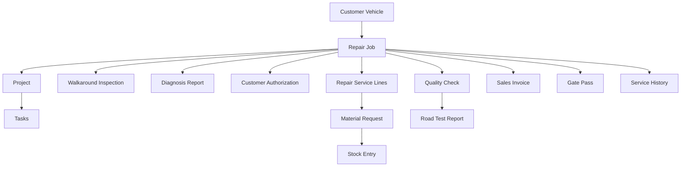

# Real-World Workflows — Auto Service Management

> A staff-facing guide to how the `auto_service_management` app is used in day-to-day workshop operations.

This document is grounded in the approved repair-management spec, the live `Repair Job` workflow, the supporting DocTypes, the acceptance scenario, and the repo knowledge graph. It explains how workshop staff actually use the app across the normal path and the important branch paths.

## Who Uses the App

| Role | Main job in the app | Typical records they touch |
|------|----------------------|----------------------------|
| Service Advisor | Check in vehicles, capture complaints, prepare estimates, follow approvals | Customer, Customer Vehicle, Repair Job, Diagnosis Report, Customer Authorization |
| Workshop Technician | Inspect, diagnose, repair, log work | Walkaround Inspection, Repair Job, Tasks, Timesheets |
| Parts Interpreter | Convert approved work into parts requests and issues | Repair Service Lines, Material Request, Stock Entry |
| Workshop Manager | Control flow, approve exceptions, review quality | Quality Check, Repair Job Override, Fleet Service Campaign |
| Cashier | Turn completed work into billable documents and payments | Sales Invoice, payment records |
| Security Gate Officer | Control vehicle release at the gate | Gate Pass |

## The Main Records and How They Connect

One visit revolves around one `Repair Job`. That job links the intake, workshop execution, ERPNext operational records, and the final release of the vehicle.



## The Core Status Journey

The `Repair Job` state machine is the backbone of the app:

```text
Draft
  -> Checked In
  -> Walkaround Inspection
  -> Diagnosis
  -> Estimate Prepared
  -> Waiting for Customer Approval
  -> Approved
  -> In Repair
  -> Quality Check
  -> Ready for Invoice
  -> Invoiced
  -> Gate Pass Issued
  -> Closed
```

Supported branch outcomes:

- `Closed - Diagnosis Only` for visits where the customer pays for diagnosis but does not proceed with repair work.
- Return from `Quality Check` back to `In Repair` when rework is needed.
- `Cancelled` before terminal completion, but not after invoicing. Once a job reaches `Invoiced`, the next workflow step is vehicle release through gate-pass handling.

## How the App Is Used in Practice

### 1. Normal Walk-In Repair

**Situation:** A returning customer walks in with a vehicle that has developed a braking noise and charging-system warning. The workshop wants one clean story in the app from reception to vehicle release.

**Realistic simulation**

At **8:07 AM**, Sarah Namata arrives at reception with her **2022 Toyota Hilux, registration UBA 417K**. She says the battery light came on the previous evening and the front brakes started making a grinding sound on the drive from Jinja town. The Service Advisor opens the `Workshop Management` workspace, uses `Vehicle Search`, and finds her existing `Customer Vehicle` record by registration number. Because the vehicle already exists in the system, the advisor does not create a new master; he opens `New Repair Job` and creates a fresh visit for this specific complaint.

Inside the `Repair Job`, the advisor records the real intake details that matter operationally: `customer`, `customer_vehicle`, `customer_concern = "Battery light on and grinding noise from front brakes"`, `odometer_in = 84,521 km`, fuel level at about a quarter tank, visit reason as walk-in corrective repair, promised pickup as same day if parts are available, and assigns the vehicle to **Bay 2**. The job starts in `Draft`. The moment the advisor performs `check_in()`, the job moves to `Checked In`, the app creates the linked ERPNext `Project`, and the visit is now visible in the live workshop queue rather than being stuck in front-desk memory or phone notes.

At **8:18 AM**, the technician receives the job card and performs the intake inspection with the customer present. He creates a `Walkaround Inspection` record, confirms the odometer, notes the existing scratches on the rear bumper, marks the left-front wheel area as the source of the noise concern, and records that the customer left one ignition key and the spare wheel in the vehicle. Saving the inspection moves the job into `Walkaround Inspection`. This matters because the workshop now has a shared, timestamped condition record before any spanner work begins.

At **8:34 AM**, the technician opens the job and starts diagnosis. In app terms, the `Repair Job` moves to `Diagnosis`, and the technician creates a `Diagnosis Report`. His findings are practical and billable: the front brake pads are worn below safe thickness, both front brake discs are scored and need machining, and the alternator belt is cracked and slipping, which explains the intermittent charging warning. He estimates **2.8 labour hours** in total: **1.2 hours** for front brake service, **0.6 hours** for disc removal and refit around machining, and **1.0 hour** for alternator belt replacement plus charging-system test. The diagnosis does not yet commit the workshop to perform the work; it turns the complaint into a structured recommendation the advisor can price and explain.

At **8:49 AM**, the Service Advisor and Parts Interpreter build the commercial side of the visit directly on the same `Repair Job`. They add `Repair Service Lines` that match the diagnosis:

| Line type | Description | Qty | Status after estimate prep | Operational meaning |
|-----------|-------------|-----|----------------------------|---------------------|
| `Parts` | Front brake pad set | 1 | `Pending Approval` | Stocked item to be requested/issued if approved |
| `Labour` | Front brake inspection, strip, clean, fit pads | 1.2 hrs | `Pending Approval` | Billable workshop time |
| `Subcontracted Service` | Front brake disc machining | 2 discs | `Pending Approval` | External machining but still tracked on the job |
| `Parts` | Alternator belt | 1 | `Pending Approval` | Replacement part to eliminate slip |
| `Labour` | Belt replacement and charging test | 1.0 hr | `Pending Approval` | Technician time tied to the fix |
| `Consumable` | Brake cleaner and shop supplies | 1 | `Pending Approval` | Small materials consumed during the job |

The advisor then runs `prepare_estimate()` and `request_authorization()`. The job moves from `Diagnosis` to `Estimate Prepared` and then to `Waiting for Customer Approval`. This is the point where the app stops the story from becoming informal. Instead of a technician verbally saying "we also changed a belt," every intended charge now exists as a visible line with quantity, type, and approval status.

At **9:06 AM**, the advisor calls Sarah, explains the findings, and sends the estimate summary. She approves the full repair up to the quoted amount. The advisor records a `Customer Authorization` with the approval method as phone plus WhatsApp confirmation, approved amount matching the estimate, and supporting notes that the customer requested the old belt and brake pads to be shown at pickup. When the authorization is approved and the advisor runs `authorize()`, every remaining pending line becomes approved, the job enters `Approved`, `customer_authorized` is set, and the system now permits workshop execution.

At **9:19 AM**, the technician starts work with `start_work()`, moving the job to `In Repair`. The Parts Interpreter uses the approved parts lines to create a `Material Request`, then issues stock through a `Stock Entry` for the **front brake pad set**, **alternator belt**, and **consumables**. This is where the app keeps workshop activity tied to real ERPNext stock movement. The parts are not just mentioned in a story; they are requested, issued, and later traceable through `Parts Used by Repair Job`.

Work happens in real time, and the job record reflects it. From **9:25 AM to 10:42 AM**, the technician removes the front wheels, confirms the pad wear, sends the discs for machining, installs the new brake pads, replaces the cracked alternator belt, checks charging voltage, and road-tests the charging warning at idle. The repair job’s labour summary is no longer guesswork:

| Labour line | Technician | Hours |
|-------------|------------|-------|
| Front brake strip, clean, inspect, refit | Moses K. | 1.2 |
| Alternator belt replacement and charging test | Moses K. | 1.0 |
| Disc remove/refit support and final checks | Moses K. | 0.6 |

Total labour captured on the job: **2.8 hours**.

Once the repair work is done, the technician or advisor marks the approved lines complete with `complete_service_lines()`. The job is then placed on `hold_for_qc()`, which moves it to `Quality Check`. At **10:55 AM**, the Workshop Manager creates the `Quality Check` record and confirms brake pedal feel, absence of warning lights, wheel nut tightness, fluid condition, and basic housekeeping. Because this job does not need a separate high-risk road test workflow, the manager passes QC immediately. The `Repair Job` moves to `Ready for Invoice`.

At **11:08 AM**, the Cashier opens the invoice queue and runs `create_sales_invoice()`. ERPNext calculates the authoritative totals, taxes, and final bill from the approved and completed lines. The job status becomes `Invoiced`, and the invoice is linked back to the `Repair Job`. Sarah pays at the counter, so there is no credit-release exception in this scenario. That is important: the workshop has finished the repair, but the vehicle is still not free to leave until release control is completed.

At **11:19 AM**, front desk creates the `Gate Pass` from the invoiced job. Security reviews the released vehicle against the gate document, confirms the recipient details, and marks the pass issued when Sarah arrives to collect the vehicle. When the pickup actually happens and the vehicle exits, security marks the pass as used. This separate release step is what prevents a workshop from confusing "invoice exists" with "vehicle may leave the premises."

Finally, at **11:27 AM**, the advisor closes the visit. Running `close()` moves the `Repair Job` to `Closed`, stamps `closed_on` and `closed_by`, updates the `Customer Vehicle` with the new service snapshot, and creates the single `Service History` record for this visit. The finished record now tells the complete story in one place: who came in, what the complaint was, what the inspection found, what diagnosis confirmed, what labour was spent, which parts were consumed, what invoice was issued, how the vehicle was released, and when the job actually ended.

**Status journey**

```text
Draft -> Checked In -> Walkaround Inspection -> Diagnosis -> Estimate Prepared
-> Waiting for Customer Approval -> Approved -> In Repair -> Quality Check
-> Ready for Invoice -> Invoiced -> Gate Pass Issued -> Closed
```

**What matters operationally**

- Intake is not optional. The app requires customer, vehicle, `odometer_in`, and reason for visit before a `Repair Job` can be created.
- The diagnosis becomes service lines before the workshop starts work, so labour hours, parts used, and subcontracted work are all auditable.
- Pricing, taxes, invoice totals, and stock/accounting effects come from ERPNext, not from workshop-side guesswork.
- Gate release is a separate control step from invoicing. A created invoice alone does not mean the vehicle can leave.

### 2. First-Time Customer With a New Vehicle

**Situation:** The workshop has never seen the customer or vehicle before.

**Realistic simulation**

At **9:02 AM**, a new customer, **Brian Ssemanda**, drives in with a **2019 Subaru Forester** that has never been serviced at this workshop before. He reports that the vehicle vibrates during braking and the steering feels slightly off-center after hitting a pothole on the Jinja road the previous week. When the Service Advisor opens `Vehicle Search`, nothing comes back for the registration number, VIN, engine number, or customer name. This is the signal that the workshop is not dealing with a repeat visit. The app has no vehicle history yet, so staff must create the base records properly before any repair work can begin.

The advisor starts by creating the `Customer` record with Brian’s basic account details. Only after the customer exists does he create the `Customer Vehicle` master. This step is more important than it looks because the vehicle master is what the rest of the workshop process will hang off. He records the registration number, make, model, year, VIN/chassis number, engine number, transmission type, fuel type, color, and current odometer. Because registration and VIN are key identifiers in the system, entering them correctly matters now; future searches, repeat visits, and service-history lookups will depend on this first capture being clean.

With the customer and vehicle now in place, the advisor creates the first `Repair Job` for the Forester. He records `customer_concern = "Brake vibration and steering misalignment after pothole impact"`, `odometer_in`, fuel level, promised feedback time, and assigns the vehicle to the alignment and brake-inspection bay. The repair job starts in `Draft`, just like any other visit, but the difference is that this job is also establishing the workshop’s first operational relationship with this vehicle.

At **9:18 AM**, the technician performs the `Walkaround Inspection`. Because this is the workshop’s first time seeing the car, the inspection captures more than immediate damage notes. It becomes the baseline condition record: current body marks, tyre condition, approximate brake feel, accessories handed over, cabin condition, and the visible state of the wheels and suspension area. Once saved, the job moves into `Walkaround Inspection`, and the workshop now has a timestamped intake record that future visits can be compared against.

At **9:33 AM**, the technician starts diagnosis and creates the `Diagnosis Report`. He confirms that the front brake discs show heat spots and the front wheel alignment is out of spec. He also notes that the left tie-rod end should be monitored but does not yet require replacement. The advisor then adds `Repair Service Lines` for brake inspection labour, front disc skimming, wheel alignment, and brake-pad replacement if required after final measurement. The estimate is prepared and sent to the customer for approval.

From this point onward, the workflow behaves like a normal repair visit: authorization, repair work, QC, invoicing, gate pass, and closure. What makes this scenario different is that every later step now attaches to a brand-new `Customer Vehicle` master created during this visit. When the workshop eventually closes the job, the vehicle record receives its first service snapshot, including updated odometer and last service information, and the system creates the first `Service History` entry for that vehicle.

That means the second time Brian returns, front desk no longer starts from scratch. Staff can search the same registration or VIN, find the `Customer Vehicle`, review the earlier complaint, see what brake and alignment work was done, and create a new `Repair Job` on top of that history instead of reconstructing the past manually.

**Why this case matters**

- The app is designed to build long-term service history around the `Customer Vehicle`, not around temporary front-desk notes.
- The first visit creates the baseline customer-and-vehicle record that future searches, repeat visits, reports, and service history depend on.
- Clean first capture of registration, VIN, engine details, and odometer reduces duplicate records and makes later workshop use much more reliable.

### 3. Diagnosis Only

**Situation:** The customer wants to know what is wrong before deciding whether to authorize repairs.

**Realistic simulation**

At **10:12 AM**, a customer arrives with a **Honda Fit** complaining that the engine light is on and fuel consumption has suddenly become worse. She makes it clear at reception that she is not yet authorizing repairs. She wants the workshop to inspect the vehicle, tell her what is wrong, and quote the fix before she decides whether to proceed. That is not a failed repair sale; it is a legitimate diagnosis-only visit, and the app supports it as its own controlled path.

The Service Advisor creates the `Repair Job`, records the complaint, `odometer_in`, and intake details, then checks the car in. The technician performs the `Walkaround Inspection`, confirms the vehicle condition at intake, and the job moves into the normal workshop flow. Diagnosis-only does not mean skipping discipline. The workshop still needs proper intake, condition capture, and traceability because the vehicle is entering the premises and consuming workshop time.

At **10:34 AM**, the technician starts diagnosis and creates the `Diagnosis Report`. He runs initial checks, reads the fault code, and finds that the likely root cause is a weak oxygen sensor response combined with a dirty throttle body. He records the findings and recommended corrective work, including the likely sensor replacement and intake cleaning. The advisor now has something concrete to explain to the customer: not just “check engine light,” but a documented diagnosis with a repair recommendation and cost implication.

The advisor prepares the estimate and calls the customer. She listens to the explanation, asks for the quotation to be sent, and says she wants to think about it before spending money on the actual repair. In this branch, the workshop does not force the job through approval and repair just because diagnosis is complete. Instead, it separates the completed diagnostic effort from the declined corrective work.

To reflect that correctly in the app, the advisor keeps the actual repair recommendations out of active approval status and adds only the diagnosis charge as a completed billable line on the job. The `Repair Job` then moves to `Ready for Invoice` for diagnosis work only. This is the key control point: the workshop is billing for professional diagnostic effort that was completed, not for parts or labour the customer did not authorize.

At **11:02 AM**, the Cashier runs `create_sales_invoice()`. ERPNext creates the invoice for the diagnosis fee, and the `Repair Job` moves to `Invoiced`. Because the customer is collecting the vehicle without repair work being carried out, front desk still creates the `Gate Pass`, and security still uses it to control exit. The release process is the same as any other visit: a vehicle does not leave the workshop just because no repair happened.

Once the gate pass is issued and the vehicle is leaving, the advisor closes the job with `close_as_diagnosis_only()`. That final status is important. It tells the system and future users that the workshop completed a real visit, performed real technical work, issued a real invoice, and released the vehicle, but the customer did not proceed with the recommended repair. The job ends as `Closed - Diagnosis Only`, not as a normal completed repair.

**Status journey**

```text
Draft -> Checked In -> Walkaround Inspection -> Diagnosis -> Ready for Invoice
-> Invoiced -> Gate Pass Issued -> Closed - Diagnosis Only
```

**What the app preserves**

- The visit still leaves an audit trail: complaint, findings, diagnosis report, invoice, gate pass, and service history snapshot.
- The customer can decline the repair without erasing the value of the diagnostic work already performed.
- The vehicle leaves with a recorded diagnosis instead of an abandoned half-record or an undocumented verbal opinion.

### 4. Partial Approval

**Situation:** The customer agrees to some service lines and rejects others.

**Realistic simulation**

At **11:20 AM**, a returning customer brings in a **Toyota Premio** complaining of weak starting in the morning, brake squeal, a knocking feel from the rear suspension, and overdue routine service. The technician completes intake and diagnosis and the advisor builds one estimate containing several findings from the same visit. This is a common real-world moment: the workshop has identified more work than the customer is ready to pay for today.

The advisor adds four `Repair Service Lines` to the `Repair Job`:

- replace battery
- replace front brake pads
- replace rear shock absorbers
- engine oil service

At this point, all four lines sit on the job as `Pending Approval`. The value of the app here is that the workshop does not have to split the story into separate paper notes or verbal side agreements. Every recommended line stays on one repair record, waiting for a clear customer decision.

When the estimate is sent, the customer agrees to pay for the **battery**, **front brake pads**, and **engine oil service**, but says the **rear shock absorbers** will have to wait until next month. In the app, the advisor does not delete the shock-absorber line or hide it. Instead, he marks the accepted lines with `approve_service_lines()` and marks the deferred suspension work with `reject_service_lines()`.

That changes the job from one big undecided estimate into one mixed-authority repair plan:

| Service line | Customer decision | App status |
|--------------|-------------------|------------|
| Replace battery | Proceed now | `Approved` |
| Replace front brake pads | Proceed now | `Approved` |
| Engine oil service | Proceed now | `Approved` |
| Replace rear shock absorbers | Defer for later | `Rejected` |

Once at least one service line is approved, the advisor can still authorize the overall visit and move the `Repair Job` into `Approved`. This is the critical business rule: the job does not fail just because the customer said no to part of the estimate. The workshop can proceed with the approved subset while preserving the rejected recommendations on the same record.

The technician then starts work and performs only the approved operations. Parts staff request and issue only the approved stock items. Labour is captured only for the work that was actually done. The rejected rear-shock line does not move into stock issue, active labour, or billing. It remains on the job as a visible deferred recommendation rather than disappearing from memory.

By the time the vehicle reaches invoicing, the `Repair Job` tells a much more accurate story than a simple yes-or-no approval model. It shows what the workshop recommended, what the customer accepted, what the customer postponed, and what the workshop actually completed. The invoice therefore reflects only the approved and completed battery, brake, and service work. The deferred suspension work stays available for the next visit, where staff can reopen the history and say, “Last time we recommended rear shocks, but you chose to postpone them.”

**What the app records clearly**

- Deferred work stays visible on the same job as rejected lines.
- Approved lines can proceed to parts request, stock issue, labour capture, and billing.
- Rejected lines stay in history for future follow-up.

### 5. Fleet Service Campaign

**Situation:** A corporate customer sends multiple vehicles for coordinated service.

**Realistic simulation**

At **7:40 AM on Monday**, **Nile Distribution Ltd** sends three field vehicles into the workshop under one maintenance instruction: a **Toyota Hiace van**, an **Isuzu D-Max pickup**, and a **Toyota Hilux**. The fleet administrator wants all three vehicles serviced this week, but each unit has a different complaint, different parts requirement, and potentially a different completion date. This is exactly where the app uses a `Fleet Service Campaign` instead of forcing staff to fake everything into one oversized repair file.

The Workshop Manager begins in the `Workshop Management` workspace and creates a `Fleet Service Campaign` named **Nile Distribution July Service Batch**. On the campaign record, he sets the corporate `customer`, campaign start and end dates, and a short description explaining that the visit combines scheduled service work with corrective repairs before the vehicles return to field duty. At this stage, the campaign is just the planning shell. It does not replace workshop execution; it defines the corporate umbrella that the actual jobs will sit under.

Front desk then handles each vehicle as its own visit. The Service Advisor searches each existing `Customer Vehicle` record and creates three separate `Repair Job` documents:

| Vehicle | Main complaint | Operational reality |
|---------|----------------|--------------------|
| Toyota Hiace | 10,000 km service, oil change, rear brake inspection | Routine service with predictable parts |
| Isuzu D-Max | Suspension knock on rough roads | Diagnosis-heavy job, may need extra approval |
| Toyota Hilux | Air-conditioning weak and cabin blower noisy | Mixed labour and parts replacement job |

Each `Repair Job` is checked in independently, gets its own `Project`, its own inspection flow, and its own status path. The manager then adds those three jobs into the `Fleet Service Campaign` child table. Once saved, the campaign synchronizes that relationship back to each linked `Repair Job` through the `fleet_service_campaign` field, so the jobs remain individually actionable while still belonging to one corporate batch.

This is the important operational difference: the campaign groups work for planning and oversight, but technicians, advisors, parts staff, cashiers, and security still work vehicle by vehicle. The Hiace can already be in `In Repair` while the D-Max is still in `Diagnosis` and the Hilux is waiting for customer approval on an A/C compressor belt and blower motor.

By **8:25 AM**, all three vehicles have completed intake. Three separate `Walkaround Inspection` records exist, one per unit, each with its own mileage, visible body condition, accessories handed over, fuel level, and pre-existing marks. This prevents the common fleet-service mistake of assuming that corporate vehicles can be processed with less documentation than retail customers. In the app, fleet discipline is tighter, not looser.

By **9:10 AM**, the workshop has already split into parallel streams:

- The **Hiace** technician completes inspection quickly, starts `Diagnosis`, confirms only normal service work is required, and the advisor adds service lines for engine oil, oil filter, drain-plug washer, labour, and brake cleaning consumables.
- The **D-Max** technician finds worn stabilizer-link bushes and one leaking front shock absorber, so the advisor prepares an estimate and requests authorization from the fleet contact before any suspension work starts.
- The **Hilux** technician confirms a weak blower motor and stretched A/C belt, so labour and parts lines are added and the job proceeds through estimate preparation.

The corporate fleet coordinator does not receive one vague combined total. Instead, the app preserves the commercial truth per vehicle. Each `Repair Job` carries its own `Repair Service Lines`, authorization state, material demand, labour hours, invoice, and closure timing. The campaign gives management one supervisory lens without destroying the repair-level audit trail.

By **11:30 AM**, the campaign shows why this structure matters. The Hiace has already moved to `Ready for Invoice` after service completion and QC. The Hilux is in `In Repair`, with parts already issued through `Material Request` and `Stock Entry`. The D-Max is still in `Waiting for Customer Approval` because the fleet coordinator wants a quote before authorizing shock replacement. If this were handled outside the app, staff would start phoning each other for status. In the system, management can open the campaign, then use `Open Repair Jobs`, `Jobs by Status`, and `Daily Workshop Load` to see exactly which vehicle is where and why.

By **2:45 PM**, the Hiace is invoiced and ready for release. The Hilux completes work later in the afternoon and moves through `Quality Check` into `Ready for Invoice`. The D-Max remains pending until the corporate approver accepts the suspension repair the next morning. The fleet campaign therefore stays open even though one of its jobs is already closed. That is correct behavior. A campaign is not “done” when the first vehicle leaves; it is done when the planned fleet batch has been worked through across its separate jobs.

Later, when the corporate accounts team asks what was done in the batch, the workshop can answer at two levels:

- at campaign level: which vehicles were included, what stage each one reached, and whether the batch is still active
- at repair-job level: exact complaints, labour hours, parts issued, approvals, invoices, gate passes, and closure details for each vehicle

**What the app enforces**

- A fleet campaign groups jobs; it does not merge them into one repair record.
- Each vehicle still needs its own `Repair Job`, `Walkaround Inspection`, diagnosis, approval path, billing, and release controls.
- Jobs from the wrong customer are rejected from the campaign.
- Duplicate job entries inside the same campaign are rejected.
- Saving the campaign synchronizes the campaign link back onto each selected `Repair Job`, so reporting and drill-down stay consistent.

### 6. Walkaround Upsell

**Situation:** The vehicle came in for one request, but the walkaround or diagnosis reveals additional billable work.

**How staff use the app**

- The technician records additional issues during `Walkaround Inspection` or `Diagnosis Report`.
- The advisor adds those findings as additional `Repair Service Lines`.
- The estimate sent to the customer now includes the original complaint plus the newly discovered work.
- The customer can approve all, some, or none of the added items.

**Why this matters**

- The app gives the workshop one place to keep original work, discovered issues, approvals, and deferrals together.
- Upsell here means documented additional work, not undocumented verbal add-ons.

### 7. Corporate Credit Release

**Situation:** The workshop has finished the job, the invoice is submitted, but the customer is allowed to take the vehicle on approved credit terms.

**Realistic simulation**

At **4:10 PM**, a **Mitsubishi L200** belonging to **Kiboko Telecom Services Ltd** has reached the end of its repair cycle. The vehicle came in two days earlier for clutch replacement and gearbox-mount noise, and the workshop has already completed the full operational path: check-in, walkaround, diagnosis, estimate approval, repair, parts issue, labour capture, and `Quality Check`. The `Repair Job` is now in `Ready for Invoice`, and the vehicle is parked in the release area waiting for finance clearance.

The Cashier opens the job from the invoice queue and runs `create_sales_invoice()`. ERPNext creates the submitted `Sales Invoice` from the approved and completed service lines. The invoice includes the clutch kit, gearbox mount, transmission oil, shop consumables, and the labour lines captured against the job. The `Repair Job` moves to `Invoiced`, and the commercial side of the work is now formal. Up to this point, nothing about the job is special just because the customer is a corporate account.

The difference begins when the fleet supervisor says their driver must return to Mbale that evening, but their accounts team will settle the invoice on the normal **30-day credit terms** already configured for the customer. Staff do not bypass the billing step or issue a gate pass just because the customer is well known. Instead, they use the app and ERPNext controls to answer a stricter question: is this customer allowed to take the vehicle now even though the invoice is not yet paid?

The finance user checks the customer’s ERPNext account configuration and confirms three things:

- the customer is marked as eligible for controlled credit release
- valid payment terms are already configured for the account
- the release will not violate the customer’s current credit control position

Once those business checks are acceptable, the workshop can proceed with physical release. The important point is that the app still requires a real invoice first. Credit release is not an alternative to invoicing; it is an alternative to immediate cash settlement at the point of release.

At **4:24 PM**, front desk creates the `Gate Pass` from the already invoiced `Repair Job`. The gate pass carries the linked `Sales Invoice`, vehicle, and recipient details. Security sees that the job has a valid invoice-backed release record, issues the pass to the company driver, and marks it used when the pickup vehicle exits the gate. The vehicle leaves legally and operationally cleared, but the financial story remains open because payment has not yet been received.

This is where the workflow matters for managers. The repair itself can be finished and the vehicle can be released, yet the business still needs visibility into unpaid released jobs. The app handles that by keeping the job in normal released/closed workflow while reports highlight that payment is still outstanding. The `Corporate Credit Releases` report becomes the follow-up tool for finance and management because it lists released or closed `Repair Job` records where `payment_status` is not `Paid`.

The next morning, the Workshop Manager reviews the report and sees the Kiboko Telecom job alongside any other vehicles that were released on account. He can filter by customer or invoice, confirm which vehicles have already left on approved terms, and coordinate with accounts without reopening the workshop-side job record. That separation is healthy: workshop execution is complete, but credit follow-up remains visible until the invoice is settled.

In practical terms, the story of this job is complete in two layers:

- operationally: the vehicle was repaired, invoiced, released, and handed back through the normal `Gate Pass` control
- financially: the invoice remains unpaid, so the job stays visible in the credit-release monitoring flow until settlement catches up

**Important distinction**

- The operational rule is that credit release depends on approved business controls, not on verbal promises at the counter.
- The app’s hard gate at `Gate Pass` level is that a linked `Sales Invoice` must exist and must already be submitted.
- Credit release changes how the vehicle is allowed to leave; it does not remove the need for invoice traceability, payment terms, or post-release follow-up.

### 8. QC Failure and Rework

**Situation:** Work is completed, but the manager or inspector is not satisfied with the result.

**Realistic simulation**

At **3:18 PM**, a **Toyota Prado** that came in for front suspension work reaches the end of the technician’s repair tasks. The customer originally complained of a knocking sound over bumps and unstable steering on rough roads. The technician has already replaced the stabilizer links and tightened associated suspension hardware, then marks the relevant service lines complete. From the technician’s perspective, the job looks finished, so the advisor moves it into `Quality Check` with `hold_for_qc()`.

The Workshop Manager opens the `Repair Job`, creates the `Quality Check` record, and starts the final inspection. He checks fitment, hardware tightness, general cleaning, warning lights, and the road feel around the workshop compound. During that inspection he notices that the left-front side still produces a slight metallic knock when the vehicle is rocked and turned at low speed. The original complaint is not fully resolved.

This is exactly the kind of case the app is meant to surface instead of hiding. The manager does not wave the job through just because most of the work is done. He records the failed outcome in `Quality Check`, notes the remaining noise, and sends the `Repair Job` back to `In Repair`. Operationally, this matters because the workshop now has an honest record that the first repair pass was not accepted as complete.

The technician receives the job back and investigates again. On the second check, he finds that one upper control-arm fastening point was not fully corrected during the first repair pass, and a washer stack needed adjustment. He completes the rework, rechecks the suspension movement, and updates the job so the outstanding issue has been addressed. Nothing about this rework is informal. The same job record shows that the vehicle went to QC, failed, returned to active repair, and then came back again for inspection.

At **4:02 PM**, the advisor places the job into `Quality Check` for the second time. The manager repeats the inspection, confirms the noise is gone, steering response is stable, and the vehicle now meets the expected workshop standard. Only after that second pass does the manager allow the job to proceed toward invoicing. The `Repair Job` moves to `Ready for Invoice`.

The value of this workflow is not only technical quality. It protects the workshop commercially and operationally. If the customer later asks why pickup was delayed, staff can point to the exact reason: the vehicle failed QC, went back for rework, and was only released forward once the original complaint was truly resolved. Without that loop, teams tend to rely on memory or deny that a near-miss happened.

In practice, this is what the app preserves during a failed QC cycle:

- the first repair attempt was completed
- QC identified a remaining problem
- the job returned to `In Repair`
- rework was performed
- QC was repeated before the job became invoice-ready

**Status journey**

```text
In Repair -> Quality Check -> In Repair -> Quality Check -> Ready for Invoice
```

**What the app makes visible**

- Rework is part of the traceable workflow, not something hidden off-record.
- The job cannot honestly be treated as invoice-ready until QC is passed.

### 9. Road-Test-Required Job

**Situation:** The job involves repair work where workshop leadership wants a test drive before release, such as steering, braking, or transmission complaints.

**Realistic simulation**

At **2:10 PM**, a **Subaru Outback** is nearing completion after coming in with two serious complaints: the steering pulled left under braking, and the vehicle felt unstable at highway speed. The workshop has already completed the mechanical work: front brake service, wheel alignment correction, and replacement of worn suspension bushes identified during diagnosis. The technician marks the repair lines complete, and the advisor moves the job into `Quality Check`.

During QC, the Workshop Manager confirms the obvious workshop-floor checks: pedal feel is firm, no warning lights are showing, fasteners are secure, fluid levels are correct, and the underbody has been rechecked after repair. But because this job involves steering and braking behavior under motion, those static checks are not enough. The manager marks that a road test is required before the job can be treated as ready for invoice.

This is where the app prevents a common workshop shortcut. Staff cannot rely on “it feels fine on the lift” for a high-risk complaint that only fully reveals itself while the vehicle is moving. Instead, the assigned staff member creates a `Road Test Report` linked to the same `Repair Job`. The report captures the route used, the start and end odometer readings, and the observed behavior under real driving conditions.

At **2:28 PM**, the technician and manager take the vehicle on a controlled test route that includes low-speed turns, moderate braking, and a short straight section where steering-centre stability can be checked. Inside the `Road Test Report`, they document:

- route taken around the industrial area and nearby tarmac section
- odometer start and end
- brake response under light and firm application
- steering-centre behavior
- whether any vibration, pulling, or warning lights remain

On the first pass, the vehicle tracks straight and braking feel is strong, but there is still a slight steering offset after the wheel returns from a corner. Because that observation is documented in the `Road Test Report`, the workshop has evidence that the job is not yet fully validated for release. The vehicle goes back for a final steering-wheel-centre correction and alignment adjustment.

At **3:05 PM**, the team performs a second road test and updates the `Road Test Report` outcome. This time, steering returns cleanly to centre, braking remains stable, and no warning lights or abnormal noises appear. Only now does workshop leadership treat the repair as fully verified. The road test is not a courtesy spin around the block; it is the final proof that the original complaint has been resolved under real operating conditions.

With the road test passed, the `Repair Job` can move forward confidently toward invoicing and release. If the customer later asks what was done to confirm the fix, staff can point to more than a verbal assurance. They can show that the vehicle was road-tested, where it was driven, what was observed, and why the workshop believed it was safe and correct to release.

**Why this case belongs in the workflow**

- `Road Test Report` is a first-class workshop transaction in the app, not an informal note outside the job record.
- It gives the team an auditable record for high-risk repairs, especially where static inspection is not enough.
- When QC marks road test as required, the road test outcome becomes part of the release decision, not an optional extra.

### 10. Cancellation Before Completion

**Situation:** The customer withdraws the job before the repair lifecycle is finished.

**Realistic simulation**

At **1:15 PM**, a walk-in customer brings in a **Nissan X-Trail** with a complaint of engine overheating in slow traffic. The Service Advisor creates the `Repair Job`, records `odometer_in`, captures the customer concern, and checks the vehicle in. A `Walkaround Inspection` is completed, the technician starts diagnosis, and the workshop confirms two likely issues: a leaking upper radiator hose and a weak radiator fan motor. The advisor adds the recommended `Repair Service Lines`, prepares the estimate, and requests customer approval.

By **2:05 PM**, the job is in `Waiting for Customer Approval`. The customer initially sounds ready to proceed, but then calls back and says he wants the vehicle to be towed to another garage where a relative works. At this point, the workshop has already used the app properly: the visit exists, the complaint is recorded, the vehicle condition at intake is documented, and the estimate has been prepared. What the app does not allow is pretending none of that happened just because the customer changed his mind.

The advisor reopens the `Repair Job`, confirms no invoice has been created, and asks the Workshop Manager to review the cancellation. Because the job is still in an active cancellable state, the manager can run `cancel()` directly on the document. The `Repair Job` moves to `Cancelled`. It disappears from the normal active repair flow, but it does not disappear from history.

This matters most when some work or operational effort has already occurred before cancellation. In this example, the workshop already spent intake time, diagnosis time, and customer-communication effort. In other cases, staff may even have reached `Approved` or `In Repair` before the customer withdraws. The live workflow still allows cancellation from those active states, but the system keeps the trail intact rather than wiping the record.

If the workshop had already requested parts, issued stock, or captured labour time before the customer stopped the job, those downstream facts would still need to be handled through the normal ERPNext commercial and stock processes. Cancellation of the `Repair Job` is not a magic eraser for inventory movement, quotations, or other operational artifacts. It simply marks that this repair lifecycle did not proceed to completion inside the workshop flow.

From a supervision standpoint, cancellation is better than silent abandonment. Later, if the customer returns and asks what was found, staff can reopen the cancelled visit and see:

- the original complaint
- the check-in details and odometer
- the inspection and diagnosis trail
- the estimate that was prepared
- the point at which the job stopped

That makes the cancelled record useful operationally and defensible commercially. The workshop can explain what happened without reconstructing the story from memory, WhatsApp messages, or paper notes.

**Important workflow boundary**

- Cancellation is supported from active non-terminal states such as `Draft`, `Checked In`, `Walkaround Inspection`, `Diagnosis`, `Estimate Prepared`, `Waiting for Customer Approval`, `Approved`, `In Repair`, `Quality Check`, and `Ready for Invoice`.
- In the live `Repair Job` workflow, cancellation is not available after `Invoiced`.
- The cancelled record stays in the system with its history intact; cancellation stops the workflow, but it does not erase the visit.

## The Workspace View Staff Actually Use

The `Workshop Management` workspace is the everyday front door for the app. It gives staff direct shortcuts to the most common surfaces:

- `Vehicle Search`
- `New Repair Job`
- `Open Repair Jobs`
- `Approval Queue`
- `Repair Queue`
- `Parts Queue`
- `QC Queue`
- `Invoice Queue`
- `Gate Passes`
- `Service History`
- `Reports`

This matters because the app is not meant to be used as a pile of disconnected forms. Staff start from the workspace, follow the queue they own, and move each job through the next control point.

## What the Reports Are For

The reporting layer turns day-to-day records into operational control:

- `Open Repair Jobs`: front-desk and manager view of active work.
- `Daily Workshop Load`: bay and workload planning.
- `Jobs by Status`: bottleneck detection across the workflow.
- `Jobs Waiting for Parts`: parts delays and supplier follow-up.
- `Technician Productivity` and `Labour Hours by Technician`: labour utilization.
- `Repair Revenue by Period`: workshop commercial performance.
- `Parts Used by Repair Job`: traceability of issued parts.
- `Vehicle Service History`: customer retention and repeat-service context.
- `Delayed Jobs`: promised-date control.
- `Gate Pass Register`: release audit.
- `Corporate Credit Releases`: vehicle releases without immediate payment.
- `Discount and Price Change Audit`: pricing-control oversight.

## What the System Never Does

1. It never creates a `Repair Job` without customer, vehicle, `odometer_in`, and reason for visit.
2. It never allows illegal status jumps outside the defined workflow transitions.
3. It never creates a `Diagnosis Report` before the job has reached the check-in and walkaround phase.
4. It never allows a `Gate Pass` to be issued unless a linked `Sales Invoice` exists and is submitted.
5. It never creates `Service History` twice for the same `Repair Job`.
6. It never treats fleet work as one giant merged job; each vehicle keeps its own repair record.

## Final Practical Insight

What changed or was decided:
- The app is best understood as one `Repair Job` moving through controlled checkpoints, with supporting records created by different roles along the way.
- The important branch paths are diagnosis-only, partial approval, fleet grouping, QC rework, road-test-supported release, corporate credit release, and cancellation before completion.

Why it matters:
- Staff can use the app consistently only if they understand both the happy path and the normal exceptions.
- Managers get cleaner audit trails, better queue control, and fewer informal side-processes.

How it can be verified:
- Compare this document against the `Repair Job` workflow and supporting DocTypes in the app.
- Re-run the acceptance scenario and confirm the described records and status path still match.
- Confirm the workspace shortcuts and report names match the installed app fixtures.

The next best action:
- Use this document as the staff onboarding and UAT walkthrough reference for `Workshop Management`.
